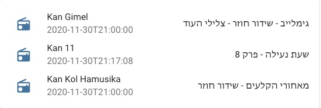

[](https://github.com/custom-components/hacs)

*Please :star: this repo if you find it useful*

<p align="left"><br>
<a href="https://paypal.me/eyalco1967?locale.x=he_IL" target="_blank"></a>
</p>

# Kan Program

A custom component to get current and next Israel Kan program.



### MANUAL INSTALLATION

1. Download the `kan_program.zip` file from the
   [latest release](https://github.com/eyalcha/kan_program/releases/latest).
2. Unpack the release and copy the `custom_components/kan_program` directory
   into the `custom_components` directory of your Home Assistant
   installation.
3. Configure Kan stations (radio / tv) you want to track.
4. Restart Home Assistant.

### INSTALLATION VIA HACS

1. Ensure that [HACS](https://custom-components.github.io/hacs/) is installed.
2. Search for and install the `kan_program` integration.
3. Configure the `kan_program` integration.
4. Restart Home Assistant.

## Configuration

Define the stations to be tracked in `configuration.yaml`


|Parameter |Required|Description
|:---|---|---
| `station_id` | Yes | Radio / Tv station id (see below)
| `name` | No | Alterntive sensor name
| `scan_interval` | No | Fetch data interval (default 15 minutes)

Example:

```yaml
sensor:
  - platform: kan_program
    station_id: 9
```

The above configuration will generate an entity with the id `kan_program.kan_gimel` and current program as the state along with these attributes:

```
attribution: Data provided by kan.org.il
station_name: Kan Gimel
description: ...
start_time: ...
end_time: ...
chapter_number: ...
next: ...
friendly_name: Kan Gimel
icon: 'mdi:radio'
```

## Services

The component also exposes the service kan_program.refresh which will refresh all the data.

## Station id

The following Kan stations supported:

Id | Station
---|---
1  | Kan 11
2  | Makan
4  | Kan 88
5  | Kan Tarbut
6  | Kan Reka
8  | Kan Moreshet
7  | Kan Kol Hamusika
8  | Kan Bet
9  | Kan Gimel

---

I put a lot of work into making this repo and component available and updated to inspire and help others! I will be glad to receive thanks from you — it will give me new strength and add enthusiasm:
<p align="center"><br>
<a href="https://paypal.me/eyalco1967?locale.x=he_IL" target="_blank"></a>
</p>
